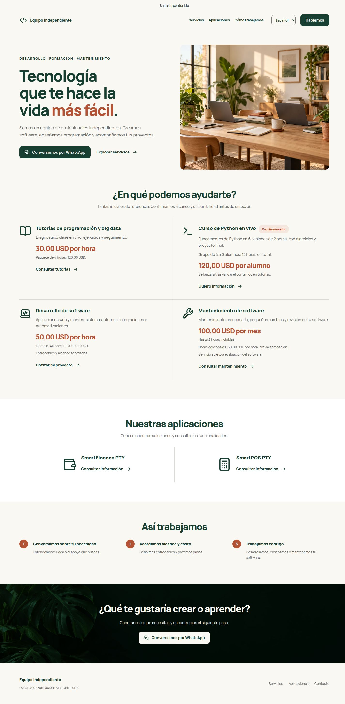
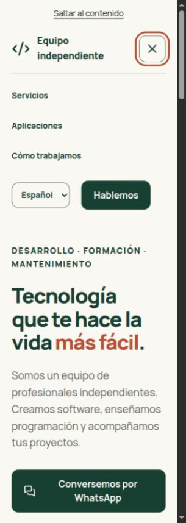
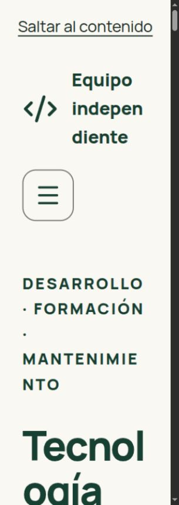

# Revisión final de la landing

Revisión realizada el 28 de septiembre de 2026 sobre la salida estática local, sin publicar. Idiomas autorizados: español e inglés. La referencia a «tres idiomas» del checklist no restablece portugués, eliminado por instrucción expresa anterior.

## Cambios y problemas corregidos

1. **Entrada e idioma — corregido.** El prerender inglés mostraba contenido inglés con «Español» seleccionado. El valor de select no bastaba para serializar la selección nativa. Ahora cada opción refleja selected tanto en atributo como propiedad; el validador comprueba el valor del selector del HTML inicial. Entrada directa y recarga de `/en` muestran English. Evidencia inicial: `qa/final-audit/01-before.jpg`.
2. **Servicios y consulta — correcto tras ajuste.** Se añadió «por hora» / «per hour» a la tarifa adicional de mantenimiento. Se conserva la aprobación previa y evaluación del software. Los siete tipos de consulta usan IDs y mensajes traducidos; no abren ni envían nada automáticamente. El recorrido por teclado llega a los 13 enlaces del contenido y footer con contorno visible.
3. **Móvil, teclado y texto ampliado — corregido.** A 320 píxeles y raíz de 32 píxeles había desbordamientos de palabras, cabecera y mínimos de Grid. Se corrigieron con overflow-wrap, columnas minmax(0, 1fr), un mínimo flexible de cabecera y texto flexible dentro de botones. No se oculta overflow ni se reduce la fuente. Menú abre con Enter, cierra al elegir sección y Escape devuelve el foco al botón. El salto al contenido enfoca main.
4. **HTML, recursos y entrega — aprobado con pendiente de imagen.** Build estático, prerender, tipos e hidratación comprobados. Recursos activos válidos y sin 404. Falta la variante hero de 1440 píxeles solicitada en la etapa de recursos; no está referenciada por la web. `check:assets` conserva su resultado fallido por ese único pendiente.

## Contenido e identidad

Se revisaron los diccionarios, la configuración y el HTML inicial de ambos idiomas. Cabecera neutral y voz del equipo en plural, sin monograma personal, empresa registrada, testimonios, integrantes, direcciones, credenciales o disponibilidad inventada. Los mensajes de consulta hablan en primera persona singular porque representan al visitante, siguiendo los mensajes proporcionados.

- Tutorías: programación/big data, diagnóstico, clase en vivo, ejercicios y seguimiento; USD 30/h, cuatro horas USD 120, sin descuento declarado.
- Curso: fundamentos de Python, seis sesiones de dos horas, ejercicios/proyecto final, grupo de 4–6, USD 120/alumno, próximo lanzamiento tras validación mediante tutorías. Sin matrícula ni pago.
- Desarrollo: web/móvil, sistemas internos, integraciones/automatización; USD 50/h de referencia, ejemplo calculado de 40 horas = USD 2,000, alcance/entregables acordados.
- Mantenimiento: USD 100/mes, dos horas incluidas, adicionales USD 50/h previa aprobación, evaluación del software. Sin promesa de soporte ilimitado ni reparación de equipos.
- SmartFinance PTY y SmartPOS PTY solo como productos con consulta de información e iconos genéricos. Sin descargas o prestaciones inventadas.

`check:public` analiza HTML, JS, CSS, SVG y otros archivos textuales de dist. No analiza documentos internos de restricciones como si fueran contenido publicado. No encontró nombres excluidos. El favicon es un símbolo neutral de código.

## Evidencia visual

Comparación con `diseño.png`: conserva crema, bosque, terracota, fotografía cálida, cuadrícula abierta de servicios 2 × 2, dos aplicaciones, tres pasos y contacto verde con hojas. No se afirma igualdad píxel a píxel: fotografía alternativa y saltos de línea fluidos varían respecto a la referencia. El selector usa nombres completos y el salto al contenido es visible por accesibilidad.

### Paso 2: página completa, escritorio

### Paso 3: menú móvil y foco

### Paso 3: texto ampliado, después de corregir

Captura parcial de viewport con texto al 200%; las palabras pueden partirse en el ancho extremo, sin recortarse ni ocultarse.

## Responsive y accesibilidad

| Ensayo                                                 | Resultado                                                                              |
| ------------------------------------------------------ | -------------------------------------------------------------------------------------- |
| 20rem / 320 px, es/en                                  | Sin scroll horizontal ni controles recortados                                          |
| 24rem / 384 px, es/en                                  | Sin scroll horizontal ni controles recortados                                          |
| 48rem / 768 px, es/en                                  | Dos columnas de servicios, sin desbordamiento                                          |
| 64rem / 1024 px, es/en                                 | Dos columnas, imágenes proporcionadas                                                  |
| 90rem / 1440 px, es/en                                 | Contenedor máximo y cuadrícula correctos                                               |
| Fuente raíz al 200% / 32 px en los cinco anchos, es/en | Diez escenarios sin desbordamiento ni recorte de textos/controles                      |
| Reflujo de 1440 × 900 a 720 × 450                      | Sin desbordamiento; equivalente geométrico al 200%, no zoom nativo                     |
| HTML inglés sin scripts                                | Cuatro servicios y todas las secciones visibles; selector inicial correcto             |
| Teclado                                                | Menú, Escape, salto y recorrido del contenido/footer comprobados; focos solid visibles |

Mediciones: `qa/final-audit/responsive.json`, `text-200.json` y `keyboard.json`. El último registro BODY del recorrido indica salida del documento al navegador; no es un control sin foco. Las pruebas automatizadas cubren movimiento reducido inicial y sobrevenido, fallo/ausencia del observador y desconexión. No se verificó una preferencia real del sistema operativo: los estados se simularon en pruebas y se inspeccionó la media query CSS.

Sin posicionamiento prohibido ni utilidades sr-only. Las medidas propias son relativas. Excepciones: píxeles en dimensiones intrínsecas de imágenes y herramientas de prueba; vw en el atributo sizes, que informa la selección del recurso responsive; dppx para densidad de pantalla. No se usa overflow hidden para tapar problemas. La paleta calculada pasa los umbrales del script, con mínimo 4.71:1 para terracota sobre crema; esto no certifica por sí solo toda la accesibilidad.

## Pruebas ejecutadas

| Comprobación                                  | Resultado                                                                                                    |
| --------------------------------------------- | ------------------------------------------------------------------------------------------------------------ |
| `build:production`                            | Correcto, tres rutas estáticas                                                                               |
| `check:prerender`                             | H1, cuatro servicios/textos completos, tarifas, idioma, selector, metadatos y datos de hidratación correctos |
| `test:ci`                                     | 36 pruebas, 10 archivos, aprobadas                                                                           |
| `test:i18n-validator`                         | 6 pruebas aprobadas                                                                                          |
| `test:seo`                                    | 3 pruebas aprobadas                                                                                          |
| `check:i18n`                                  | 83 claves es/en, interpolaciones coincidentes y sin vacías                                                   |
| `typecheck`, `check:styles`, `check:contrast` | Aprobados                                                                                                    |
| `check:public --http` mediante script         | 29 archivos publicados responden 200, referencias válidas, sin nombres excluidos                             |
| `check:assets`                                | FALLA por `team-workspace-1440.webp` ausente; los recursos presentes pasan                                   |
| Decodificación adicional                      | Pillow abre los cuatro WebP y las cuatro resoluciones ICO; navegador carga Manrope WOFF2                     |

Se conservan licencias locales de Lucide y Manrope, originales fotográficos y su procedencia en assets.md. Ningún recurso activo depende de URLs temporales. No se detectaron errores de hidratación del origen estático en el navegador. Se inspeccionaron enlaces de WhatsApp sin enviar mensajes. No se inventaron puntuaciones de rendimiento.

## Pendientes y límites

- **Dominio real:** publicSiteUrl sigue null; canonical/hreflang/sitemap omitidos y robots bloquea indexación incluso en build de producción. No se inventa un dominio.
- **Imagen 1440 × 1200:** requiere un original de suficiente resolución nativa. El original disponible no permite producirla sin ampliación artificial. Las variantes activas de 480/960 funcionan.
- **Información comercial:** fecha/lanzamiento del curso y funcionalidades/destinos de productos permanecen sin añadir hasta autorización/datos reales. El teléfono está confirmado; la prueba no verifica una cuenta de WhatsApp.
- **No verificado:** zoom nativo del navegador al 200%, lectores de pantalla reales, dispositivo táctil físico y matriz de navegadores. El ensayo de fuente aumentada y reflujo no se presenta como sustitución total de esas pruebas.
- No se realizó despliegue, commit, push, análisis de campo ni medición Lighthouse.
